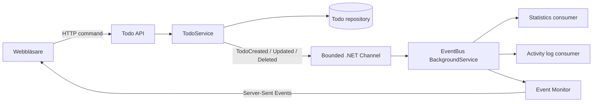

# Event-driven Architecture

## Vad visar projektet?

Projektet är en todo-app som använder en lokal, asynkron Event-driven Architecture
(EDA) för sidoeffekter. Användarens commands och queries går via HTTP, men efter en
domänförändring publicerar applikationen ett event till en kö. Oberoende consumers
uppdaterar sedan statistik och aktivitetslogg utan att `TodoService` anropar dem direkt.

Det är därför en **hybridarkitektur**:

- HTTP request/response används mellan webbläsaren och API:et.
- Asynkrona events används för interna reaktioner på förändringar.
- Kön och alla consumers kör i samma process.

Lösningen visar EDA-principer och eventual consistency, men är inte ett distribuerat
produktionssystem. Den använder ingen extern broker som RabbitMQ eller Kafka.

## Vilket problem löser arkitekturen?

När en todo skapas, uppdateras eller raderas behöver flera oberoende saker reagera:

- aktivitetsstatistik ska uppdateras;
- en loggrad ska skrivas;
- framtida funktioner, exempelvis notifieringar, kan vilja reagera på samma händelse.

Utan events måste `TodoService` känna till och anropa alla dessa funktioner. Med
publish/subscribe behöver servicen bara meddela vad som redan har hänt. Producenten
behöver inte känna till antalet consumers, deras implementation eller hur lång tid de
tar.

## Översikt



### Producent

`TodoService` utför domänoperationen och publicerar därefter ett event. Exempel:

```csharp
repository.Add(todo);
await eventPublisher.Publish(new TodoCreated(todo.Id, todo.Title));
```

`Publish` väntar bara tills eventet har accepterats av kön. Den väntar inte på att
statistik eller loggning ska slutföras.

### Events

`TodoCreated`, `TodoUpdated` och `TodoDeleted` är oföränderliga snapshots. De innehåller
bara information som var sann när händelsen inträffade, inte en muterbar referens till
domänobjektet. Alla events har även:

- `EventId` för att identifiera det enskilda eventet;
- `OccurredAt` för när domänhändelsen skapades;
- `CorrelationId` för att koppla eventet till den inkommande operationen.

Namnen beskriver något som redan har hänt. De är events, inte instruktioner som
`CreateTodo` eller `WriteLog`.

### Eventkö och dispatcher

`EventBus` har två roller i den lokala demonstrationen:

1. Den tar emot events och skriver dem till en begränsad `.NET Channel`.
2. Som `BackgroundService` läser den kön och distribuerar events till subscribers.

Kön har kapacitet för 100 events och använder backpressure: om kön blir full väntar
producenten på ledig plats. En enda reader behandlar events i FIFO-ordning. Consumers
för samma event startas oberoende och inväntas tillsammans innan nästa event tas.

### Consumers

Det finns två logiska consumers som prenumererar på alla tre eventtyper:

- `StatisticsEventHandler` uppdaterar räknarna.
- `ActivityLogEventHandler` skriver till `log.txt`.

De känner inte till varandra. Om en consumer kastar ett exception loggas felet och
markeras i Event Monitor, medan övriga consumers får fortsätta.

### Event Monitor

`EventMonitor` sparar de senaste 100 spårningsposterna i minnet. Endpointen
`GET /events/stream` strömmar dem till webbläsaren med Server-Sent Events (SSE).
Webbläsaren grupperar posterna efter event-ID och visar bland annat:

- `queued`;
- `processing`;
- `consumer-started`;
- `consumer-completed` eller `consumer-failed`;
- `completed` eller `completed-with-errors`.

SSE-flödet är observability för demon och inte själva eventkön. Consumers tar sina
events från Channel, inte från webbläsarströmmen.

## Dataflöde när en todo skapas

1. Webbläsaren skickar `POST /todos`.
2. `TodoService` validerar och sparar todo:n i repositoryt.
3. Servicen skapar ett oföränderligt `TodoCreated` och publicerar det.
4. Eventet läggs i Channel och API:et kan svara `201 Created`.
5. Webbläsaren kan redan visa todo:n, medan statistiken fortfarande är oförändrad.
6. `EventBus` hämtar eventet efter den Development-konfigurerade demofördröjningen.
7. Statistik- och loggconsumers behandlar eventet oberoende.
8. Event Monitor visar varje steg via SSE.
9. När eventet är färdigbehandlat hämtar frontend aktuell statistik.

Steg 5 visar **eventual consistency**: todo-datan och statistiken kan under en kort tid
visa olika versioner av systemets tillstånd.

## Varför finns en demofördröjning?

Asynkron bearbetning går vanligtvis så snabbt lokalt att köläget knappt syns. Därför är
`EventProcessing:DemoDelayMilliseconds` satt till `1000` i
`appsettings.Development.json`. Standardvärdet i `appsettings.json` är `0`.
Fördröjningen är en visualiseringsteknik, inte ett krav i arkitekturen.

## Fel, leverans och avgränsningar

Lösningen gör medvetna förenklingar:

- **Icke-beständig kö:** events i Channel försvinner om processen avslutas.
- **At-most-once i praktiken:** det finns inga automatiska retries.
- **Ingen dead-letter queue:** misslyckade events visas och loggas men köas inte om.
- **Ingen distribuerad skalning:** API, kö och consumers delar process och minne.
- **Möjligt dual-write-glapp:** repositoryt kan uppdateras precis innan publicering
  misslyckas. En produktionslösning skulle kunna använda Outbox Pattern.
- **Minnesbaserad data:** todos, statistik och eventhistorik nollställs vid omstart.

Det här är viktigt att säga öppet. En extern broker definierar inte ensam EDA, men den
behövs ofta för beständighet, distribution och mer robust leverans.

## Designmönster och principer

- **Publish/subscribe:** en producent publicerar och flera subscribers reagerar.
- **Observer:** registreringen av handlers liknar Observer pattern, men leveransen sker
  asynkront genom en kö.
- **Domain events:** eventnamnen beskriver relevanta förändringar i todo-domänen.
- **Dependency Injection:** producenten beror på `IEventPublisher` och consumers på
  små interfaces för sina sidoeffekter.
- **Eventual consistency:** read models och sidoeffekter uppdateras efter huvudoperationen.
- **Lös koppling:** en ny consumer kan registreras utan ändring i `TodoService`.

## Vägen till en distribuerad version

För en större produktionslösning kan Channel ersättas av RabbitMQ, Azure Service Bus
eller Kafka och consumers flyttas till separata processer. Då behöver lösningen även:

- beständig eventlagring och Outbox Pattern;
- retry-policy och dead-letter queue;
- idempotenta consumers som tål dubbletter;
- kontraktsversionering för events;
- autentisering och åtkomstkontroll;
- metrics, distribuerad tracing och larm.

Producentens centrala kontrakt kan ändå vara detsamma: den publicerar vad som har hänt
utan att känna till vem som reagerar.

## Sammanfattning

Projektet demonstrerar nu skillnaden mellan att bara använda eventliknande metodanrop
och att faktiskt behandla events asynkront. API:et avslutar huvudoperationen efter att
eventet köats, consumers reagerar oberoende, statistiken blir eventually consistent och
hela flödet kan följas live. Samtidigt är implementationens lokala och icke-beständiga
begränsningar tydligt dokumenterade.
