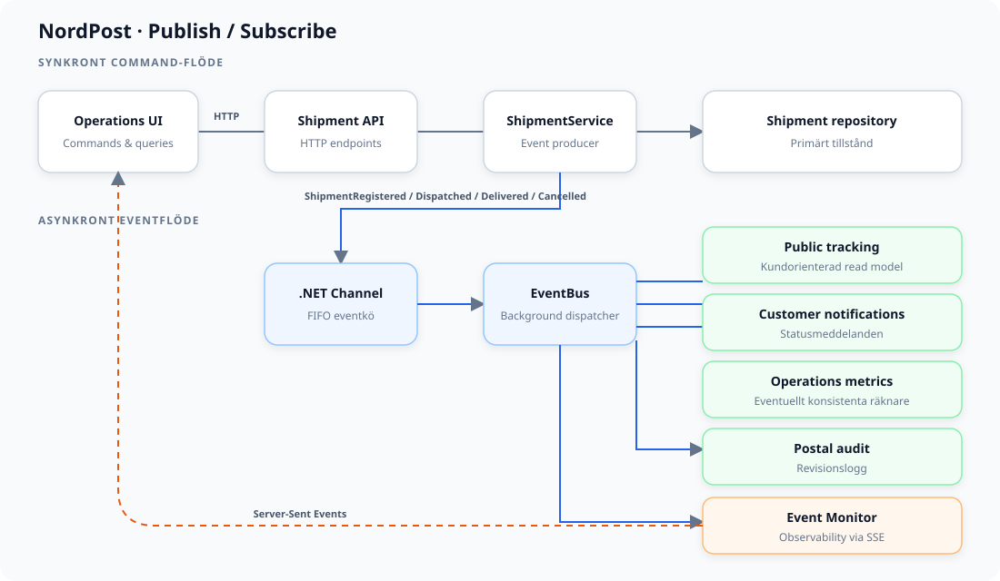

# NordPost – Event-driven Architecture

## Vad visar projektet?

NordPost är en förenklad paketplattform inspirerad av verkliga postoperatörer. En
operatör kan registrera, skicka, leverera och avbryta försändelser. Varje genomförd
domänändring publicerar ett event som flera fristående tjänster prenumererar på.

Lösningen är en **hybridarkitektur**:

- webbläsaren skickar commands och queries via HTTP;
- `ShipmentService` ändrar försändelsens primära tillstånd;
- oföränderliga domänevents läggs i en begränsad `.NET Channel`;
- en `BackgroundService` distribuerar eventet till alla registrerade subscribers;
- Server-Sent Events visar flödet i gränssnittet, men transporterar inte events till
  domänens subscribers.

Kön och alla subscribers kör i samma process. Projektet demonstrerar EDA, publish/
subscribe och eventual consistency, men är inte ett distribuerat produktionssystem.

## Domän och livscykel

En `Shipment` har spårningsnummer, mottagare, destination och status. Tillåtna
övergångar är:

```text
Registered → InTransit → Delivered
     └─────────┴──────→ Cancelled
```

API:et erbjuder följande commands:

- `POST /shipments` – registrera en försändelse;
- `PUT /shipments/{id}/dispatch` – skicka försändelsen;
- `PUT /shipments/{id}/deliver` – markera den som levererad;
- `PUT /shipments/{id}/cancel` – avbryt en ännu ej levererad försändelse.

Ogiltiga statusövergångar svarar med `409 Conflict` och publicerar inget event.

## Publicerade events

- `ShipmentRegistered`
- `ShipmentDispatched`
- `ShipmentDelivered`
- `ShipmentCancelled`

Eventnamnen beskriver något som redan har hänt. Varje event är en oföränderlig
snapshot med försändelse-ID, spårningsnummer, mottagare och destination samt:

- `EventId` – identifierar eventinstansen;
- `OccurredAt` – när händelsen skapades;
- `CorrelationId` – kopplar eventet till den inkommande operationen.

Producenten känner bara till `IEventPublisher`. Den vet inte vilka subscribers som
finns eller hur lång tid de behöver.

## Subscribers

Fyra oberoende tjänster prenumererar på samtliga försändelseevents:

1. **Public tracking** bygger en separat, kundorienterad tracking-projektion som kan
   läsas via `GET /tracking/{trackingNumber}`.
2. **Customer notifications** reagerar med rätt mottagarmeddelande för varje status.
3. **Operations metrics** uppdaterar räknare för registrerade, skickade, levererade
   och avbrutna försändelser.
4. **Postal audit** skriver en beständig revisionsrad till `postal-audit.log`.

De känner inte till varandra. En ny subscriber kan registreras utan att
`ShipmentService` ändras. Alla fyra startas oberoende och inväntas tillsammans. Om en
subscriber misslyckas loggas felet och övriga får fortsätta.

## Dataflöde vid registrering

1. Webbläsaren skickar `POST /shipments`.
2. `ShipmentService` validerar och sparar försändelsen i repositoryt.
3. Servicen publicerar `ShipmentRegistered`.
4. `EventBus.Publish` accepterar eventet i Channel-kön.
5. HTTP-anropet kan svara `201 Created`; försändelsen syns direkt i command-modellen.
6. Efter den avsiktliga demofördröjningen hämtar `EventBus` eventet.
7. Dispatchern startar tracking, notifieringar, metrics och audit parallellt.
8. Tracking-projektionen och operationsräknarna blir uppdaterade först nu.
9. Event Monitor visar varje steg via SSE.

Steg 5–8 demonstrerar **eventual consistency**: det primära försändelsetillståndet kan
vara nyare än subscriber-tjänsternas read models under en kort period.

## Kö och leverans

Channel-kön har kapacitet 100 och använder backpressure. Om kön är full väntar
producenten på ledig plats i stället för att tappa eventet. En reader behandlar events
i FIFO-ordning. `EventProcessing:DemoDelayMilliseconds` är `500` i Development för
att kön ska synas i demon; standardvärdet är `0`.

### Realistisk subscriber-simulering

Subscribers startar från samma fan-out men tar olika lång tid, precis som separata
system med olika typer av I/O. Development-konfigurationen väljer en ny slumpmässig
latens inom respektive intervall för varje event:

| Subscriber | Simulerat arbete | Latens |
|---|---|---:|
| Postal audit | lokal append | 40–180 ms |
| Operations metrics | snabb räknaruppdatering | 120–400 ms |
| Public tracking | uppdatering av read model | 350–900 ms |
| Customer notifications | externt meddelandegateway | 1 400–2 800 ms |

Intervallen styrs av `SubscriberSimulation` i `appsettings.Development.json`. De är
skalade för en presentation och representerar relativa skillnader, inte verkliga SLA:er.
Utanför Development är alla simulerade delays noll. Event Monitor mäter och visar den
faktiska tiden för varje subscriber.

## Begränsningar

- kön är minnesbaserad och events försvinner vid omstart;
- det finns inga retries eller dead-letter queue;
- leveransen är i praktiken at-most-once;
- repository, tracking-projektion, metrics och eventhistorik ligger i minnet;
- ändring av domäntillstånd och publicering är inte en atomisk transaktion;
- API, broker och subscribers kan inte skalas separat.

En produktionsvariant skulle använda exempelvis Kafka, RabbitMQ eller Azure Service
Bus, ett Outbox Pattern, idempotenta consumers, retries, dead-letter queue,
kontraktsversionering och distribuerad tracing.

## Mönster och principer

- **Publish/subscribe:** ett event distribueras till flera subscribers.
- **Domain events:** kontrakten uttrycker faktiska logistikhändelser.
- **Eventual consistency:** tracking och metrics uppdateras asynkront.
- **Lös koppling:** producenten känner inte sina mottagare.
- **CQRS-liknande projektion:** public tracking är en separat eventdriven read model.
- **Dependency Injection:** abstraktioner kopplar ihop implementationerna i `Program.cs`.


